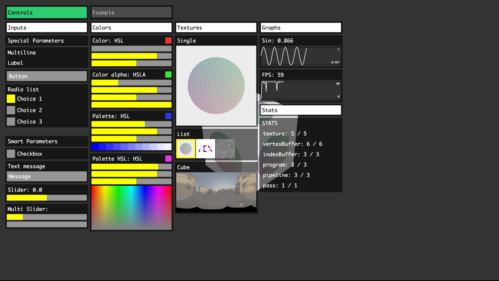

# pex-gui

GUI controls for the pex library.



## Usage

```js
const createContext = require('pex-context')
const createGUI = require('pex-gui')

const State = {
  rotation: 0
}

const ctx = createContext()
const gui = createGUI(ctx)

gui.addParam('Rotation', State, 'rotation', {
  min: -Math.PI / 2,
  max: Math.PI / 2
})

ctx.frame(() => {
  gui.draw()
})
```

## API

### GUI

#### gui = createGUI(ctx [, options])

- `ctx`: Context - gl context from `pex-context`
- `options.theme`: Object - optional theme customiser object. Colors defined by `rgba()` strings. See [theme file](https://github.com/pex-gl/pex-gui/blob/master/theme.js) for all options.

```js
const createGUI = require('pex-gui')

const gui = createGUI(ctx)
```

#### `gui.draw()`

Renders the GUI. Should be called at the end of the frame.

#### `gui.addTab(title)`

Add a tab component.

| option  | info          | type   |
| ------- | ------------- | ------ |
| `title` | Control title | String |

```js
gui.addTab('Example')
```

#### `gui.addColumn(title)`

Add a column component.

| option  | info          | type   |
| ------- | ------------- | ------ |
| `title` | Control title | String |

```js
gui.addColumn('Inputs')
```

#### `gui.addSeparator()`

Add some breathing space between controls.

```js
gui.addSeparator()
```

#### `gui.addParam(title, object, propName, [, opts, onChange])`

| option            | info                              | type     |
| ----------------- | --------------------------------- | -------- |
| `title`           | Control title                     | String   |
| `object`          | Source object holding the value   | Object   |
| `propName`        | Source object property to control | String   |
| `opts.min`        | Minimum value                     | Number   |
| `opts.min`        | Maximum value                     | Number   |
| `onChange(value)` | Callback triggered on change      | Function |

```js
gui.addParam('Checkbox', State, 'rotate')

gui.addParam('Text message', State, 'text', {}, function(value) {
  console.log(value)
})

gui.addParam('Slider', State, 'range', {
  min: -Math.PI / 2,
  max: Math.PI / 2
})

gui.addParam('Multi Slider', State, 'position', {
  min: 0,
  max: 10
})

gui.addParam('Color [RGBA]', State, 'color')

gui.addParam('Texture', State, 'texture')
gui.addParam('Texture Cube', State, 'textureCube')
```

#### `gui.addButton(title, onClick)`

Add a clickable button.

| option    | info                        | type     |
| --------- | --------------------------- | -------- |
| `title`   | Control title               | String   |
| `onClick` | Callback triggered on click | Function |

```js
gui.addButton('Button', () => {
  console.log('Called back')
})
```

#### `gui.addRadioList(title, object, index, items, onChange)`

Add a radio list with options.

| option     | info                            | type                                    |
| ---------- | ------------------------------- | --------------------------------------- |
| `title`    | Control title                   | String                                  |
| `object`   | Source object holding the value | Object                                  |
| `index`    | Index of the initial option     | Number                                  |
| `items`    | List of options                 | Array of `{ name: String, value: Int }` |
| `onChange` | Callback triggered on change    | Function                                |

```js
gui.addRadioList(
  'Radio list',
  State,
  'currentRadioListChoice',
  State.radioListChoices
)
```

#### `gui.addTexture2D(title, texture)`

Add a texture visualiser (from pex-context).

| option    | info           | type      |
| --------- | -------------- | --------- |
| `title`   | Control title  | String    |
| `texture` | Texture object | Texture2D |

```js
gui.addTexture2D('Single', State.textures[1])
```

---

Notes: texture cannot be updated once created.

#### `gui.addTexture2DList(title, object, index, items, itemsPerRow, onChange)`

Add a texture visualiser for multiple textures (from pex-context).

| option        | info                            | type                                          |
| ------------- | ------------------------------- | --------------------------------------------- |
| `title`       | Control title                   | String                                        |
| `object`      | Source object holding the value | Object                                        |
| `index`       | Index of the initial texture    | Number                                        |
| `items`       | List of textures                | Array of `{ texture: Texture2D, value: Int }` |
| `itemsPerRow` | Number of items per row         | Number (default 4)                            |
| `onChange`    | Callback triggered on change    | Function                                      |

```js
gui.addTexture2DList(
  'List',
  State,
  'currentTexture',
  State.textures.map((tex, index) => ({ texture: tex, value: index }))
)
```

---

Notes: texture cannot be updated once created.

#### `gui.addTextureCube(title, texture, options)`

Add a cube texture visualiser (from pex-context).

| option               | info                                                                               | type      |
| -------------------- | ---------------------------------------------------------------------------------- | --------- |
| `title`              | Control title                                                                      | String    |
| `texture`            | Texture object                                                                     | Texture2D |
| `options.flipEnvMap` | should be 1 for dynamic cubemaps and -1 for cubemaps from file with X axis flipped | Number    |

```js
gui.addTextureCube('Cube', State.cubeTexture)
```

---

Notes: texture cannot be updated once created.

#### `gui.addFPSMeeter()`

Add a FPS counter.

```js
gui.addFPSMeeter()
```

#### `gui.setEnabled(state)`

Enable or disable the gui visibility.

#### `gui.isEnabled()`

Check if the gui is enabled.

#### `gui.toggleEnabled()`

Toggle the gui visibility.

#### `gui.serialize()`

Retrieve a serialized value of the current GUI's state.

#### `gui.deserialize(data)`

Deserialize a previously serialized data state GUI's state.

#### `gui.dispose()`

Remove events listeners, empty list of controls and dispose of the gui's resources.

## License

MIT, see [LICENSE.md](http://github.com/pex-gl/pex-gui/blob/master/LICENSE.md) for details.
