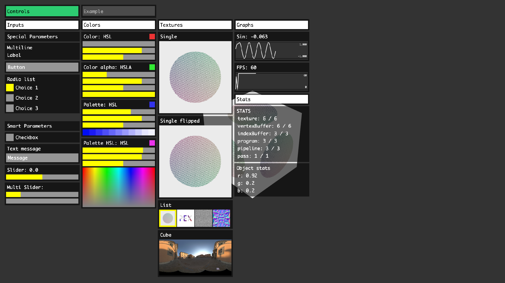

# pex-gui

GUI widgets for the pex library



# Usage

```js
const ctx = require('pex-context')()
const createGUI = require('pex-gui')

const settings = {
  force: 0
}

const gui = createGUI(ctx)
gui.addParam('Force', settings, 'force', { min: 0, max: 1 })

ctx.frame(() => {
  gui.draw()
})
```

# API

## GUI

### gui = createGUI(ctx)

- `ctx`: Context - gl context from `pex-context`

```javascript
const createGUI = require('pex-gui')
const gui = createGUI(ctx)
```

### `gui.draw()`

Renders the gui. Should be called at the end of the frame.

### `gui.addParam(name, object, propName, [, opts, onChange])`

- `name`: String
- `object`: Object - source object holding the value
- `propName`: String - source object property to control
- `opts`:
  - `min`: Number, min value
  - `max`: Number, max value
- `onChange`: Function, on change callback

```javascript
gui.addParam('Force', settings, 'force', { min: 0, max: 1 })
```

### `addButton(title, onClick)`

### `addRadioList(title, contextObject, attributeName, items, onchange)`

- `items`: Array of `{ name: String, value: Int }`

### `addTexture2DList(title, contextObject, attributeName, items, itemsPerRow, onchange)`

- `items`: Array of `Texture2D` (from pex-context)

### `addTexture2D(title, texture, options)`

### `addTextureCube(title, texture, { flipEnvMap: 1 })`

- `flipEnvMap` - should be 1 for dynamic cubemaps and -1 for cubemaps from file with X axis flipped

### `addFPSMeeter()`

### `setEnabled(state)`

### `isEnabled()`

### `toggleEnabled()`

### `serialize()`

### `deserialize(data)`
